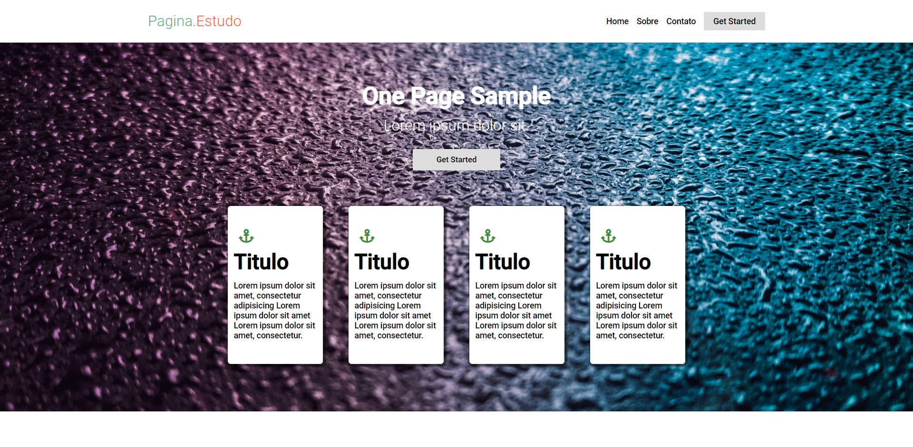
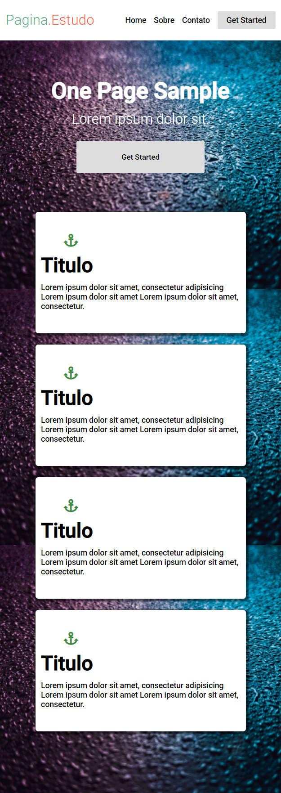

<h1 align="center">
  
</h1>

<h2 align="center">
  <button class="btn" style="padding: 7px 16px; color: #000; transition-timing-function: ease;">
  <a href="https://riancarlosdev.github.io/pagina.estudo/" style="text-decoration: none; color: #000">Click aqui e acesse a pagina</a>
  </button>
</h2>

<h2 align="center" style="font-size:30px; background-color: #4F4F4F; margin: 50px 50px; cursor: default;">IMAGENS DO ESTUDO
<h3 style="cursor:default;">🖥️ Desktop:

<h3 style="cursor:default;">📱 Mobile:

<h2 align="center" style="font-size:30px; background-color: #4F4F4F; margin: 15px 50px; cursor: default"> APRESENTAÇÃO GIF
<h2>

<h2 align="center">
  <button class="btn" style="padding: 7px 16px; color: #000; transition-timing-function: ease;">
  <a href="https://riancarlosdev.github.io/pagina.estudo/" style="text-decoration: none; color: #000">Click aqui e acesse a pagina</a>
  </button>
</h2>

<h2 align="center" style="font-size:30px; background-color: #4F4F4F; margin: 50px 50px; cursor: default;">SOBRE</h2>
Esse a pagina é um clone do conteudo de um youtuber que cria uma pagina em uma live para aprimorar o conhecimento dos desenvolverdores iniciantes, com isso tirei muitaas duvidas que eu tinha em relação a formatação e separação de cada item dos site web, segue a baixo 2 listas do meu resulmo: 
<ul> Oque aprendi:
  <li> Melhorei minha noção de como a separar cada elemento na pagina e usar o css em cada uma dela de maneira correta, mais ainda preciso melhorar
  <li> À como usar o hover
  <li> À como ultilizar o Display
</ul>
<ul> Minhas dificuldades:
  <li> Dá o primeiro passo